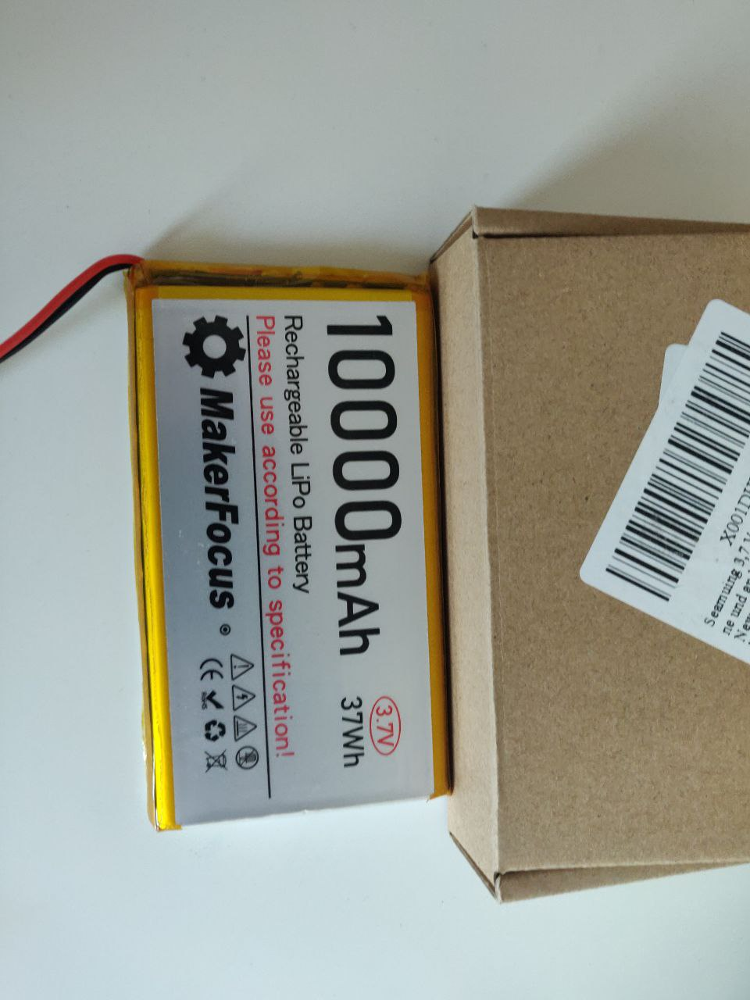

# Inventory

| Title                         | Usage      | Location       | Owner         | Bought Since | Bought Source | Status         | Image                                    |
| ----------------------------- | ---------- | -------------- | ------------- | ------------ | ------------- | -------------- | ---------------------------------------- |
| 2 Channel Relay               |            | Eugenio's home |               | Beginning    |               |                |                                          |
| Air pressure connection       |            | Eugenio's home |               | Beginning    |               |                |                                          |
| Breadbord                     |            | Eugenio's home |               | Beginning    |               |                |                                          |
| Buck Converter                |            | Eugenio's home |               | Beginning    |               |                |                                          |
| Jumper Cables                 |            | Eugenio's home |               | Beginning    |               |                |                                          |
| Lipo Battery                  | Not needed | Eugenio's home | To be defined | Beginning    |               |                |    |
| Moisture Sensor               |            | Eugenio's home |               | Beginning    |               |                |                                          |
| Raspberry Pi 1                | Not needed | Eugenio's home | Lyubomir      | Beginning    |               | To be returned |  |
| Solenoid Valve                |            | Eugenio's home |               | Beginning    |               | To be returned |                                          |
| Temperature - Humidity Sensor |            | Eugenio's home |               | Beginning    |               |                |                                          |
